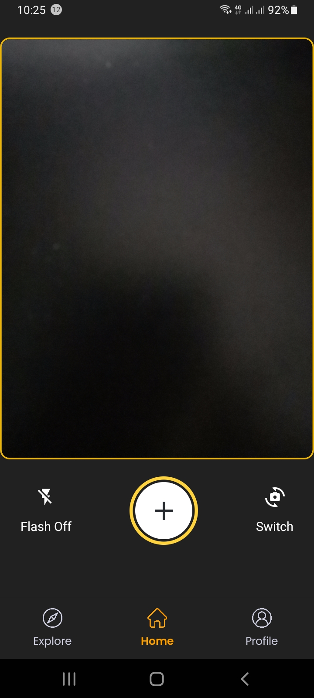
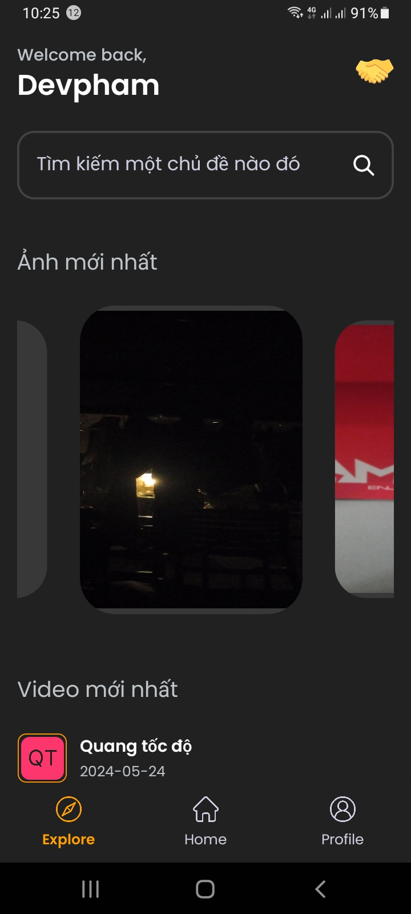
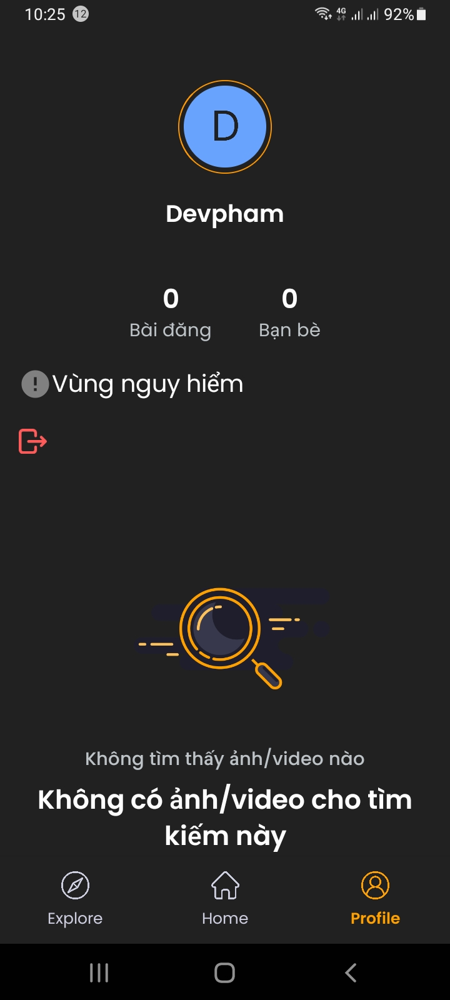

## Cài đặt:

- gõ lệnh: npm install để cài các package
- sau đó gõ npm start để chạy

- lên CH play tải app expo go để có thể chạy app trực tiếp khi chạy code bằng mã QR

## Giao diện ứng dụng

### Giao diện chụp/quay

## Giao diện Explore

## Giao diện profile

